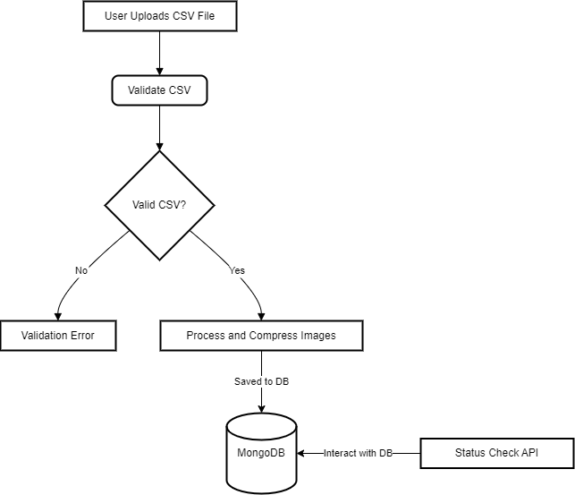

# Image Processing System Technical Design

## Overview

This document provides a detailed technical overview of the Image Processing System, including a visual diagram, descriptions of the components, and their roles and functions.

## System Architecture

### Visual Diagram

**System Diagram**: The following diagram represents the high-level architecture of the Image Processing System.

 

### Components and Their Functions

1. **CSV Upload Endpoint (API Gateway)**:
   - **Role**: Acts as the entry point for uploading CSV files. It handles file validation, generates a unique request ID, and triggers the image processing pipeline.
   - **Key Functions**:
     - Accepts CSV files and optional webhook URLs.
     - Validates the CSV file format and content.
     - Saves the file metadata and initial status in the database.

2. **CSV Parser**:
   - **Role**: Parses the uploaded CSV file to extract product information and image URLs.
   - **Key Functions**:
     - Validates the structure of the CSV.
     - Converts CSV rows into structured data for further processing.

3. **Database (MongoDB)**:
   - **Role**: Stores all necessary data, including request IDs, processing statuses, product data, and image URLs.
   - **Key Functions**:
     - Stores metadata for each processing request.
     - Tracks the status of each request (e.g., pending, processing, completed, failed).
     - Stores the original and compressed image URLs.

4. **Image Processing Service**:
   - **Role**: Handles asynchronous image processing tasks, such as compressing images by 50%.
   - **Key Functions**:
     - Downloads images from the URLs specified in the CSV.
     - Compresses images to the required size/quality.
     - Stores the processed images in the file system or cloud storage.

5. **Webhook Handling Service**:
   - **Role**: Sends notifications to a specified webhook URL after image processing is complete.
   - **Key Functions**:
     - Triggers an HTTP POST request to the provided webhook URL.
     - Includes the request ID, status, and processed image URLs in the payload.

6. **Status Check Endpoint (API Gateway)**:
   - **Role**: Provides a mechanism for users to check the processing status of their requests.
   - **Key Functions**:
     - Accepts a request ID as input.
     - Returns the current status and any available results (e.g., processed image URLs).

7. **Storage**:
   - **Role**: Stores both the original and processed images.
   - **Key Functions**:
     - Local or cloud-based storage for image files.
     - Organized directory structure based on request IDs or timestamps.
